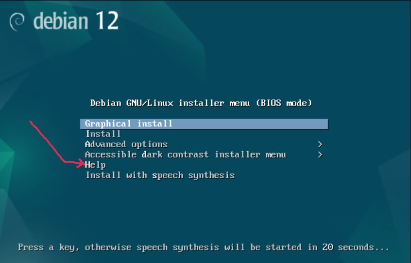
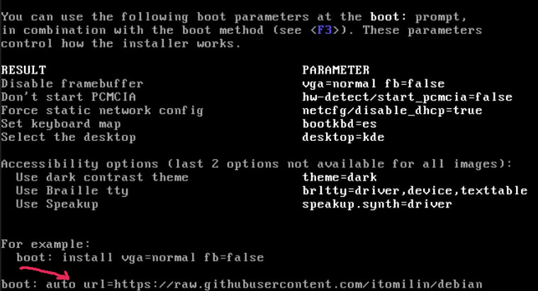
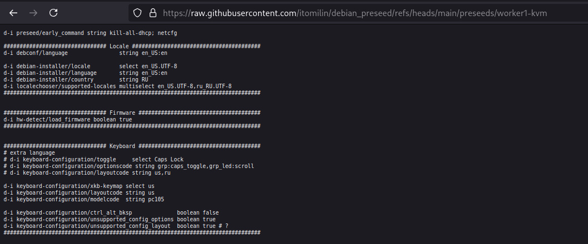

Change the environment variables in the **generate_preseed.sh** file and generate a preseed file for yourself.

!!Check makefile!!

https://wiki.debian.org/DebianInstaller/Preseed

# Loading the preseeding file from a webserver

When the graphical installer boot menu appears, PRESS the "Help" entry
Press F8

The file must be presented as lines on a public web server. (auto url=<your_url>) for example:

auto url=https://raw.githubusercontent.com/itomilin/debian_preseed/refs/heads/main/preseeds/worker1-kvm

# TODO: pack preseed to iso
https://wiki.debian.org/DebianInstaller/Preseed/EditIso